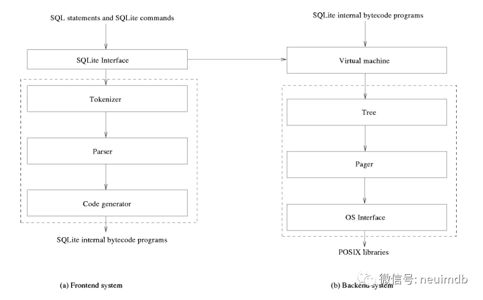
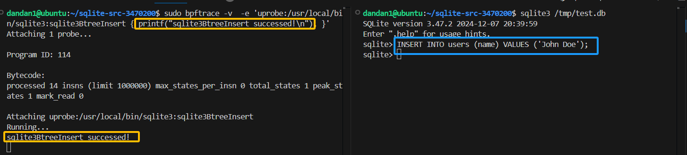
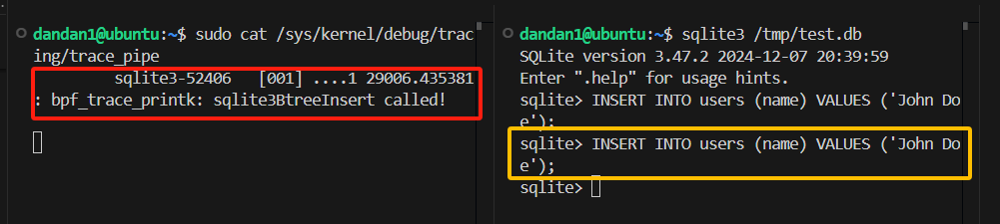

#### Sqlite3 源码---架构图

#### 一、架构



sqlite的内部嵌入了一个sql语言编译和执行环境。这就涉及到编译原理的知识。

- 首先我们以c语言为例，c语言针对不同体系结构可以编译成不同架构的汇编代码，比如x86或arm汇编。汇编代码是可以直接通过cpu取指执行的。
- 以JVM为代表的虚拟机开启了一种一处编译多处执行的技术，运行在jvm上的语言有java、scala、kotlin、Clojure、Groovy。c#也是采用了java虚拟机类似的做法。虚拟机层面抽象了一套面向虚拟机的字节码和字节码执行环境，比如上述jvm的语言都会编译成.class文件。
- LLVM（Low Level Virtual Machine）：这给编译技术提供了一种通用的后端技术框架，比如c语言的新一代编译器前端clang，它生成后端llvm可以执行的机器IR码。方舟编译器也是采用了类似的技术。

sqlite同样按照前后端的方式设计系统，前端负责编译sql成sqlite机器码，涉及到的API主要是sqlite3_prepare_v2；后端设计了一个虚拟机引擎，负责执行编译的机器码，涉及到的API主要是sqlite3_step。

**以下分层介绍各层的功能：**

1. sqlite interface: 对外部暴露的API，用于操作.db数据库
2. Tokenizer：词法分析器
3. Parser：语法分析器
4. Code Generator：sql优化器和生成机器码
5. Virtual Machine：解释执行机器码
6. Tree：基于B+树的table存储
7. Pager：磁盘块管理系统
8. OS interface：sqlite为了跨平台，对不同系统的系统相关API进行了统一封装。

#### 二、SQLite 的 `INSERT` 操作

主要是解析SQL语句、准备数据、执行插入、更新索引、事务管理以及最终的磁盘写入。

首先，要在命令行进行解析的话，命令行工具调用sqlite3_exec()，解析后的 SQL 语句会传递给 `sqlite3_exec()` 函数来执行。`sqlite3_exec()` 是 SQLite 中执行 SQL 的常见接口。

- **命令行工具**: 用户输入 SQL 语句 → 命令行工具解析 → 调用 `sqlite3_exec()`。
- **C 语言程序**: 开发者编写代码 → 调用 `sqlite3_exec()` 执行 SQL。

```c
//src/legacy.c
//sqlite3_exec 是一个比较高层的 API，它的内部实现调用了许多其他低层的 SQLite 函数来执行 SQL 语句并处理结果。
int sqlite3_exec(
  sqlite3 *db,                /* The database on which the SQL executes */
  const char *zSql,           /* The SQL to be executed */
  sqlite3_callback xCallback, /* Invoke this callback routine */
  void *pArg,                 /* First argument to xCallback() */
  char **pzErrMsg             /* Write error messages here */
){
  int rc = SQLITE_OK;         /* Return code */
  const char *zLeftover;      /* Tail of unprocessed SQL */
  sqlite3_stmt *pStmt = 0;    /* The current SQL statement */
  char **azCols = 0;          /* Names of result columns */
  int callbackIsInit;         /* True if callback data is initialized */

  if( !sqlite3SafetyCheckOk(db) ) return SQLITE_MISUSE_BKPT;
  if( zSql==0 ) zSql = "";

  sqlite3_mutex_enter(db->mutex);
  sqlite3Error(db, SQLITE_OK);
  while( rc==SQLITE_OK && zSql[0] ){
    int nCol = 0;
    char **azVals = 0;

    pStmt = 0;
    rc = sqlite3_prepare_v2(db, zSql, -1, &pStmt, &zLeftover); //解析SQL语句
    assert( rc==SQLITE_OK || pStmt==0 );
    if( rc!=SQLITE_OK ){
      continue;
    }
    if( !pStmt ){
      /* this happens for a comment or white-space */
      zSql = zLeftover;
      continue;
    }
    callbackIsInit = 0;

    while( 1 ){
      int i;
      rc = sqlite3_step(pStmt);  //执行SQL语句

      /* Invoke the callback function if required */
      if( xCallback && (SQLITE_ROW==rc || 
          (SQLITE_DONE==rc && !callbackIsInit
                           && db->flags&SQLITE_NullCallback)) ){
        if( !callbackIsInit ){
          nCol = sqlite3_column_count(pStmt);
          azCols = sqlite3DbMallocRaw(db, (2*nCol+1)*sizeof(const char*));
          if( azCols==0 ){
            goto exec_out;
          }
          for(i=0; i<nCol; i++){
            azCols[i] = (char *)sqlite3_column_name(pStmt, i);
            /* sqlite3VdbeSetColName() installs column names as UTF8
            ** strings so there is no way for sqlite3_column_name() to fail. */
            assert( azCols[i]!=0 );
          }
          callbackIsInit = 1;
        }
        if( rc==SQLITE_ROW ){
          azVals = &azCols[nCol];
          for(i=0; i<nCol; i++){
            azVals[i] = (char *)sqlite3_column_text(pStmt, i);
            if( !azVals[i] && sqlite3_column_type(pStmt, i)!=SQLITE_NULL ){
              sqlite3OomFault(db);
              goto exec_out;
            }
          }
          azVals[i] = 0;
        }
        if( xCallback(pArg, nCol, azVals, azCols) ){
          /* EVIDENCE-OF: R-38229-40159 If the callback function to
          ** sqlite3_exec() returns non-zero, then sqlite3_exec() will
          ** return SQLITE_ABORT. */
          rc = SQLITE_ABORT;
          sqlite3VdbeFinalize((Vdbe *)pStmt);
          pStmt = 0;
          sqlite3Error(db, SQLITE_ABORT);
          goto exec_out;
        }
      }

      if( rc!=SQLITE_ROW ){
        rc = sqlite3VdbeFinalize((Vdbe *)pStmt);
        pStmt = 0;
        zSql = zLeftover;
        while( sqlite3Isspace(zSql[0]) ) zSql++;
        break;
      }
    }

    sqlite3DbFree(db, azCols);
    azCols = 0;
  }

exec_out:
  if( pStmt ) sqlite3VdbeFinalize((Vdbe *)pStmt);
  sqlite3DbFree(db, azCols);

  rc = sqlite3ApiExit(db, rc);
  if( rc!=SQLITE_OK && pzErrMsg ){
    *pzErrMsg = sqlite3DbStrDup(0, sqlite3_errmsg(db));
    if( *pzErrMsg==0 ){
      rc = SQLITE_NOMEM_BKPT;
      sqlite3Error(db, SQLITE_NOMEM);
    }
  }else if( pzErrMsg ){
    *pzErrMsg = 0;
  }

  assert( (rc&db->errMask)==rc );
  sqlite3_mutex_leave(db->mutex);
  return rc;
}
```

函数参数：

- **`sqlite3 *db`**: 数据库连接对象，用于指明要操作的数据库。
- **`const char *zSql`**: 要执行的 SQL 语句，可以是多条 SQL 语句。
- **`sqlite3_callback xCallback`**: 一个回调函数，用来处理查询结果。如果 SQL 语句返回结果行（例如 `SELECT`），则此回调函数会被调用。
- **`void *pArg`**: 传递给回调函数的附加参数。
- **`char **pzErrMsg`**: 如果出错，返回的错误消息。

**例子：**

如果我们在命令行工具或 C 语言代码中执行以下 SQL 语句：

```
INSERT INTO users (name, age) VALUES ('Alice', 30);
```

SQLite 会按照以下步骤执行：

- `sqlite3_exec` 被调用，`zSql` 中包含了这条 `INSERT` 语句。
- 通过 `sqlite3_prepare_v2` 解析 SQL 语句并准备执行。(前端)
- 使用 `sqlite3_step` 执行插入操作（没有查询结果，所以不会调用回调函数）。（后端）
- 插入操作完成后，`sqlite3_exec` 返回 `SQLITE_OK`，并且释放相关资源。

**1、解析SQL语句**（前端）

```c
//sqlite-src-3470200/src/prepare.c
int sqlite3_prepare_v2(
  sqlite3 *db,              /* Database handle. */
  const char *zSql,         /* UTF-8 encoded SQL statement. */
  int nBytes,               /* Length of zSql in bytes. */
  sqlite3_stmt **ppStmt,    /* OUT: A pointer to the prepared statement */
  const char **pzTail       /* OUT: End of parsed string */
){
  int rc;
  /* EVIDENCE-OF: R-37923-12173 The sqlite3_prepare_v2() interface works
  ** exactly the same as sqlite3_prepare_v3() with a zero prepFlags
  ** parameter.
  **
  ** Proof in that the 5th parameter to sqlite3LockAndPrepare is 0 */
  rc = sqlite3LockAndPrepare(db,zSql,nBytes,SQLITE_PREPARE_SAVESQL,0,
                             ppStmt,pzTail);
  assert( rc==SQLITE_OK || ppStmt==0 || *ppStmt==0 );
  return rc;
}
int sqlite3_prepare_v3(
  sqlite3 *db,              /* Database handle. */
  const char *zSql,         /* UTF-8 encoded SQL statement. */
  int nBytes,               /* Length of zSql in bytes. */
  unsigned int prepFlags,   /* Zero or more SQLITE_PREPARE_* flags */
  sqlite3_stmt **ppStmt,    /* OUT: A pointer to the prepared statement */
  const char **pzTail       /* OUT: End of parsed string */
){
  int rc;
  /* EVIDENCE-OF: R-56861-42673 sqlite3_prepare_v3() differs from
  ** sqlite3_prepare_v2() only in having the extra prepFlags parameter,
  ** which is a bit array consisting of zero or more of the
  ** SQLITE_PREPARE_* flags.
  **
  ** Proof by comparison to the implementation of sqlite3_prepare_v2()
  ** directly above. */
  rc = sqlite3LockAndPrepare(db,zSql,nBytes,
                 SQLITE_PREPARE_SAVESQL|(prepFlags&SQLITE_PREPARE_MASK),
                 0,ppStmt,pzTail);
  assert( rc==SQLITE_OK || ppStmt==0 || *ppStmt==0 );
  return rc;
}
```

`sqlite3_prepare_v2` 和 `sqlite3_prepare_v3` 最终都调用了 `sqlite3LockAndPrepare` 函数来执行准备过程。区别仅在于 `sqlite3_prepare_v3` 会传递 `prepFlags` 参数，而 `sqlite3_prepare_v2` 则将该参数置为默认值。

```c
//sqlite3LockAndPrepare 是 SQLite 内部用来准备 SQL 语句并进行锁定的一个函数
//如下为SQL语句的编译尝试
//sqlite-src-3470200/src/prepare.c
rc = sqlite3Prepare(db, zSql, nBytes, prepFlags, pOld, ppStmt, pzTail);
assert( rc == SQLITE_OK || *ppStmt == 0 );

static int sqlite3LockAndPrepare(
  sqlite3 *db,              /* Database handle. */
  const char *zSql,         /* UTF-8 encoded SQL statement. */
  int nBytes,               /* Length of zSql in bytes. */
  u32 prepFlags,            /* Zero or more SQLITE_PREPARE_* flags */
  Vdbe *pOld,               /* VM being reprepared */
  sqlite3_stmt **ppStmt,    /* OUT: A pointer to the prepared statement */
  const char **pzTail       /* OUT: End of parsed string */
){
  int rc;
  int cnt = 0;

#ifdef SQLITE_ENABLE_API_ARMOR
  if( ppStmt==0 ) return SQLITE_MISUSE_BKPT;
#endif
  *ppStmt = 0;
  if( !sqlite3SafetyCheckOk(db)||zSql==0 ){
    return SQLITE_MISUSE_BKPT;
  }
  sqlite3_mutex_enter(db->mutex);
  sqlite3BtreeEnterAll(db);
  do{
    /* Make multiple attempts to compile the SQL, until it either succeeds
    ** or encounters a permanent error.  A schema problem after one schema
    ** reset is considered a permanent error. */
    rc = sqlite3Prepare(db, zSql, nBytes, prepFlags, pOld, ppStmt, pzTail);
    assert( rc==SQLITE_OK || *ppStmt==0 );
    if( rc==SQLITE_OK || db->mallocFailed ) break;
  }while( (rc==SQLITE_ERROR_RETRY && (cnt++)<SQLITE_MAX_PREPARE_RETRY)
       || (rc==SQLITE_SCHEMA && (sqlite3ResetOneSchema(db,-1), cnt++)==0) );
  sqlite3BtreeLeaveAll(db);
  rc = sqlite3ApiExit(db, rc);
  assert( (rc&db->errMask)==rc );
  db->busyHandler.nBusy = 0;
  sqlite3_mutex_leave(db->mutex);
  assert( rc==SQLITE_OK || (*ppStmt)==0 );
  return rc;
}
```

`sqlite3Prepare` 是实际进行 SQL 语句编译的函数，它会解析 SQL 并准备好虚拟机（VM）执行 SQL 操作。`prepFlags` 是一个标志，用于指定编译过程中的一些选项（如 `SQLITE_PREPARE_SAVESQL` 等）。如果编译成功，返回 `SQLITE_OK`，否则返回错误码。

`ppStmt` 是 `sqlite3_stmt` 结构体的指针，该结构体实际上包含了虚拟机（VDBE）对象。在 `sqlite3Prepare` 函数执行时，会填充 `ppStmt` 指向的 `sqlite3_stmt` 结构体，这个结构体会包含编译后的虚拟机对象（或者更具体地说，`Vdbe` 结构体）中。

`sqlite3_stmt` 结构体中的 VDBE 对象会通过 `sqlite3_stmt` 这个句柄供后续调用使用，比如执行 SQL 语句时通过 `sqlite3_step` 来逐步执行字节码。

```c
//sqlite-src-3470200/src/prepare.c
/*
** Compile the UTF-8 encoded SQL statement zSql into a statement handle.
*/
static int sqlite3Prepare(
  sqlite3 *db,              /* Database handle. */
  const char *zSql,         /* UTF-8 encoded SQL statement. */
  int nBytes,               /* Length of zSql in bytes. */
  u32 prepFlags,            /* Zero or more SQLITE_PREPARE_* flags */
  Vdbe *pReprepare,         /* VM being reprepared */
  sqlite3_stmt **ppStmt,    /* OUT: A pointer to the prepared statement */
  const char **pzTail       /* OUT: End of parsed string */
){
  int rc = SQLITE_OK;       /* Result code */
  int i;                    /* Loop counter */
  Parse sParse;             /* Parsing context */

  /* sqlite3ParseObjectInit(&sParse, db); // inlined for performance */
  memset(PARSE_HDR(&sParse), 0, PARSE_HDR_SZ);
  memset(PARSE_TAIL(&sParse), 0, PARSE_TAIL_SZ);
  sParse.pOuterParse = db->pParse;
  db->pParse = &sParse;
  sParse.db = db;
  if( pReprepare ){
    sParse.pReprepare = pReprepare;
    sParse.explain = sqlite3_stmt_isexplain((sqlite3_stmt*)pReprepare);
  }else{
    assert( sParse.pReprepare==0 );
  }
  assert( ppStmt && *ppStmt==0 );
  if( db->mallocFailed ){
    sqlite3ErrorMsg(&sParse, "out of memory");
    db->errCode = rc = SQLITE_NOMEM;
    goto end_prepare;
  }
  assert( sqlite3_mutex_held(db->mutex) );

  /* For a long-term use prepared statement avoid the use of
  ** lookaside memory.
  */
  if( prepFlags & SQLITE_PREPARE_PERSISTENT ){
    sParse.disableLookaside++;
    DisableLookaside;
  }
  sParse.prepFlags = prepFlags & 0xff;

  /* Check to verify that it is possible to get a read lock on all
  ** database schemas.  The inability to get a read lock indicates that
  ** some other database connection is holding a write-lock, which in
  ** turn means that the other connection has made uncommitted changes
  ** to the schema.
  **
  ** Were we to proceed and prepare the statement against the uncommitted
  ** schema changes and if those schema changes are subsequently rolled
  ** back and different changes are made in their place, then when this
  ** prepared statement goes to run the schema cookie would fail to detect
  ** the schema change.  Disaster would follow.
  **
  ** This thread is currently holding mutexes on all Btrees (because
  ** of the sqlite3BtreeEnterAll() in sqlite3LockAndPrepare()) so it
  ** is not possible for another thread to start a new schema change
  ** while this routine is running.  Hence, we do not need to hold 
  ** locks on the schema, we just need to make sure nobody else is 
  ** holding them.
  **
  ** Note that setting READ_UNCOMMITTED overrides most lock detection,
  ** but it does *not* override schema lock detection, so this all still
  ** works even if READ_UNCOMMITTED is set.
  */
  if( !db->noSharedCache ){
    for(i=0; i<db->nDb; i++) {
      Btree *pBt = db->aDb[i].pBt;
      if( pBt ){
        assert( sqlite3BtreeHoldsMutex(pBt) );
        rc = sqlite3BtreeSchemaLocked(pBt);
        if( rc ){
          const char *zDb = db->aDb[i].zDbSName;
          sqlite3ErrorWithMsg(db, rc, "database schema is locked: %s", zDb);
          testcase( db->flags & SQLITE_ReadUncommit );
          goto end_prepare;
        }
      }
    }
  }

#ifndef SQLITE_OMIT_VIRTUALTABLE
  if( db->pDisconnect ) sqlite3VtabUnlockList(db);
#endif

  if( nBytes>=0 && (nBytes==0 || zSql[nBytes-1]!=0) ){
    char *zSqlCopy;
    int mxLen = db->aLimit[SQLITE_LIMIT_SQL_LENGTH];
    testcase( nBytes==mxLen );
    testcase( nBytes==mxLen+1 );
    if( nBytes>mxLen ){
      sqlite3ErrorWithMsg(db, SQLITE_TOOBIG, "statement too long");
      rc = sqlite3ApiExit(db, SQLITE_TOOBIG);
      goto end_prepare;
    }
    zSqlCopy = sqlite3DbStrNDup(db, zSql, nBytes);
    if( zSqlCopy ){
      sqlite3RunParser(&sParse, zSqlCopy);
      sParse.zTail = &zSql[sParse.zTail-zSqlCopy];
      sqlite3DbFree(db, zSqlCopy);
    }else{
      sParse.zTail = &zSql[nBytes];
    }
  }else{
    sqlite3RunParser(&sParse, zSql);
  }
  assert( 0==sParse.nQueryLoop );

  if( pzTail ){
    *pzTail = sParse.zTail;
  }

  if( db->init.busy==0 ){
    sqlite3VdbeSetSql(sParse.pVdbe, zSql, (int)(sParse.zTail-zSql), prepFlags);
  }
  if( db->mallocFailed ){
    sParse.rc = SQLITE_NOMEM_BKPT;
    sParse.checkSchema = 0;
  }
  if( sParse.rc!=SQLITE_OK && sParse.rc!=SQLITE_DONE ){
    if( sParse.checkSchema && db->init.busy==0 ){
      schemaIsValid(&sParse);
    }
    if( sParse.pVdbe ){
      sqlite3VdbeFinalize(sParse.pVdbe);
    }
    assert( 0==(*ppStmt) );
    rc = sParse.rc;
    if( sParse.zErrMsg ){
      sqlite3ErrorWithMsg(db, rc, "%s", sParse.zErrMsg);
      sqlite3DbFree(db, sParse.zErrMsg);
    }else{
      sqlite3Error(db, rc);
    }
  }else{
    assert( sParse.zErrMsg==0 );
    *ppStmt = (sqlite3_stmt*)sParse.pVdbe;
    rc = SQLITE_OK;
    sqlite3ErrorClear(db);
  }


  /* Delete any TriggerPrg structures allocated while parsing this statement. */
  while( sParse.pTriggerPrg ){
    TriggerPrg *pT = sParse.pTriggerPrg;
    sParse.pTriggerPrg = pT->pNext;
    sqlite3DbFree(db, pT);
  }

end_prepare:

  sqlite3ParseObjectReset(&sParse);
  return rc;
}
```

- 解析SQL：`sqlite3RunParser` 来解析 SQL 语句，并将解析结果保存在 `sParse` 结构体中。`sParse` 是一个 `Parse` 结构体，它用于存储与 SQL 语句解析相关的上下文信息，包括虚拟机（VDBE）对象。
- 虚拟机对象的创建：在解析 SQL 语句后，`sParse.pVdbe` 会包含虚拟机（VDBE）对象。这是通过 `sqlite3RunParser` 创建的。如果解析成功，`sParse.pVdbe` 就指向一个有效的 VDBE 对象。虚拟机对象是在 `sqlite3RunParser` 内部生成的，并通过 `sParse.pVdbe` 进行访问。
- 将VDBE赋值给ppStmt：在解析成功并且没有错误时，`sParse.pVdbe` 被赋值给 `*ppStmt`，即 `sqlite3_stmt` 结构体指针。这个 `sqlite3_stmt` 结构体包含了虚拟机（VDBE）对象，而 `ppStmt` 就是返回给调用者的准备好的 SQL 语句句柄。
- 虚拟机（VDBE）对象的生成与初始化：`sqlite3RunParser` 在内部会通过多种方式来构建虚拟机对象，其中包括通过 `sqlite3VdbeCreate` 或类似函数来创建虚拟机（VDBE）对象，并将其关联到 `Parse` 结构体的 `pVdbe` 成员中。

总结：虚拟机对象是在 `sqlite3Prepare` 中通过解析 SQL 语句生成的，并通过 `Parse` 结构体存储，最终返回给调用者的 `sqlite3_stmt` 结构体指向该虚拟机对象。

2、准备数据（指虚拟机指令的执行和与数据库存储层（如 B-tree）之间的数据交互过程）

**执行SQL语句**（后端）

当 `sqlite3Prepare` 解析 SQL 时，内部会创建一个虚拟机（Vdbe），并通过该虚拟机生成执行操作的指令。在 `sqlite3Step` 执行时，它会根据这个虚拟机的指令集逐步执行 SQL 操作。`sqlite3Step` 的参数是 `sqlite3_stmt`，而 `sqlite3_stmt` 只是指向一个包含虚拟机指令集的结构，执行时会根据这些指令逐步执行。

```
大致调用链：
sqlite3Prepare -> 解析 SQL，生成并返回 sqlite3_stmt。
sqlite3_step是公共 API，暴露给外部程序，用户通过它来与数据库交互。sqlite3Step 是 sqlite3_step 的底层实现，用于执行 SQL 语句的具体逻辑
sqlite3Step -> 使用 sqlite3_stmt 执行已准备的 SQL。
```

```c
//sqlite-src-3470200/src/vdbeapi.c
int sqlite3_step(sqlite3_stmt *pStmt){
    ...
   while( (rc = sqlite3Step(v))==SQLITE_SCHEMA && cnt++ < SQLITE_MAX_SCHEMA_RETRY ){
       ...
   }
   
}

static int sqlite3Step(Vdbe *p){
  sqlite3 *db;
  int rc;

  assert(p);
  db = p->db;
  if( p->eVdbeState!=VDBE_RUN_STATE ){
    restart_step:
    if( p->eVdbeState==VDBE_READY_STATE ){
      if( p->expired ){
        p->rc = SQLITE_SCHEMA;
        rc = SQLITE_ERROR;
        if( (p->prepFlags & SQLITE_PREPARE_SAVESQL)!=0 ){
          /* If this statement was prepared using saved SQL and an
          ** error has occurred, then return the error code in p->rc to the
          ** caller. Set the error code in the database handle to the same
          ** value.
          */
          rc = sqlite3VdbeTransferError(p);
        }
        goto end_of_step;
      }

      /* If there are no other statements currently running, then
      ** reset the interrupt flag.  This prevents a call to sqlite3_interrupt
      ** from interrupting a statement that has not yet started.
      */
      if( db->nVdbeActive==0 ){
        AtomicStore(&db->u1.isInterrupted, 0);
      }

      assert( db->nVdbeWrite>0 || db->autoCommit==0
          || (db->nDeferredCons==0 && db->nDeferredImmCons==0)
      );

#ifndef SQLITE_OMIT_TRACE
      if( (db->mTrace & (SQLITE_TRACE_PROFILE|SQLITE_TRACE_XPROFILE))!=0
          && !db->init.busy && p->zSql ){
        sqlite3OsCurrentTimeInt64(db->pVfs, &p->startTime);
      }else{
        assert( p->startTime==0 );
      }
#endif

      db->nVdbeActive++;
      if( p->readOnly==0 ) db->nVdbeWrite++;
      if( p->bIsReader ) db->nVdbeRead++;
      p->pc = 0;
      p->eVdbeState = VDBE_RUN_STATE;
    }else

    if( ALWAYS(p->eVdbeState==VDBE_HALT_STATE) ){
      /* We used to require that sqlite3_reset() be called before retrying
      ** sqlite3_step() after any error or after SQLITE_DONE.  But beginning
      ** with version 3.7.0, we changed this so that sqlite3_reset() would
      ** be called automatically instead of throwing the SQLITE_MISUSE error.
      ** This "automatic-reset" change is not technically an incompatibility,
      ** since any application that receives an SQLITE_MISUSE is broken by
      ** definition.
      **
      ** Nevertheless, some published applications that were originally written
      ** for version 3.6.23 or earlier do in fact depend on SQLITE_MISUSE
      ** returns, and those were broken by the automatic-reset change.  As a
      ** a work-around, the SQLITE_OMIT_AUTORESET compile-time restores the
      ** legacy behavior of returning SQLITE_MISUSE for cases where the
      ** previous sqlite3_step() returned something other than a SQLITE_LOCKED
      ** or SQLITE_BUSY error.
      */
#ifdef SQLITE_OMIT_AUTORESET
      if( (rc = p->rc&0xff)==SQLITE_BUSY || rc==SQLITE_LOCKED ){
        sqlite3_reset((sqlite3_stmt*)p);
      }else{
        return SQLITE_MISUSE_BKPT;
      }
#else
      sqlite3_reset((sqlite3_stmt*)p);
#endif
      assert( p->eVdbeState==VDBE_READY_STATE );
      goto restart_step;
    }
  }

#ifdef SQLITE_DEBUG
  p->rcApp = SQLITE_OK;
#endif
#ifndef SQLITE_OMIT_EXPLAIN
  if( p->explain ){
    rc = sqlite3VdbeList(p); //如果开启了 EXPLAIN 模式，列出查询的字节码
  }else
#endif /* SQLITE_OMIT_EXPLAIN */
  {
    db->nVdbeExec++;   // 增加执行计数器
    rc = sqlite3VdbeExec(p);  // 执行字节码
    db->nVdbeExec--;  //执行完成后减少执行计数器
  }

  if( rc==SQLITE_ROW ){
    assert( p->rc==SQLITE_OK );
    assert( db->mallocFailed==0 );
    db->errCode = SQLITE_ROW;
    return SQLITE_ROW;
  }else{
#ifndef SQLITE_OMIT_TRACE
    /* If the statement completed successfully, invoke the profile callback */
    checkProfileCallback(db, p);
#endif
    p->pResultRow = 0;
    if( rc==SQLITE_DONE && db->autoCommit ){
      assert( p->rc==SQLITE_OK );
      p->rc = doWalCallbacks(db);
      if( p->rc!=SQLITE_OK ){
        rc = SQLITE_ERROR;
      }
    }else if( rc!=SQLITE_DONE && (p->prepFlags & SQLITE_PREPARE_SAVESQL)!=0 ){
      /* If this statement was prepared using saved SQL and an
      ** error has occurred, then return the error code in p->rc to the
      ** caller. Set the error code in the database handle to the same value.
      */
      rc = sqlite3VdbeTransferError(p);
    }
  }

  db->errCode = rc;
  if( SQLITE_NOMEM==sqlite3ApiExit(p->db, p->rc) ){
    p->rc = SQLITE_NOMEM_BKPT;
    if( (p->prepFlags & SQLITE_PREPARE_SAVESQL)!=0 ) rc = p->rc;
  }
end_of_step:
  /* There are only a limited number of result codes allowed from the
  ** statements prepared using the legacy sqlite3_prepare() interface */
  assert( (p->prepFlags & SQLITE_PREPARE_SAVESQL)!=0
       || rc==SQLITE_ROW  || rc==SQLITE_DONE   || rc==SQLITE_ERROR
       || (rc&0xff)==SQLITE_BUSY || rc==SQLITE_MISUSE
  );
  return (rc&db->errMask);
}
```

`sqlite3VdbeExec(p)` 是 SQLite 的核心函数之一，负责根据字节码执行相应的操作。它实际上是执行 SQL 查询的底层函数，并处理所有的插入、更新、删除等操作。具体的执行细节包括：

- 从字节码中读取操作码并执行相应的数据库操作（例如插入数据、查询数据等）。
- 操作数据存储（比如插入新记录）并维护数据库状态。
- 更新数据库缓存、索引等。

`sqlite3_step` 总结:

- `sqlite3_step` 是 SQLite 提供的一个接口，用来执行 SQL 语句。
- 在没有启用 `EXPLAIN` 模式时，它会调用 `sqlite3VdbeExec(p)` 来执行字节码，完成 SQL 操作（例如 `INSERT`）。
- `sqlite3VdbeExec(p)` 负责执行具体的操作，并进行底层的数据修改（例如插入、更新、删除等）。

**3、执行插入**

`sqlite3VdbeExec` 解析

在 SQLite 中，`sqlite3VdbeExec` 是执行字节码（VDBE 指令）时的关键函数，它负责逐步执行 SQL 语句的各个操作，包括插入操作。插入操作通常会由 `INSERT` 语句生成的字节码来表示，这些字节码包括一系列 VDBE 操作码（opcode），其中涉及将数据插入到表中。

`sqlite3VdbeExec` 是执行字节码的核心函数，它会根据 `Vdbe` 结构中保存的字节码指令逐步执行相应的操作。在 `sqlite3_step` 调用链中，它会调用很多辅助函数来处理不同的 SQL 操作。以下是这部分的调用链：

```c
//sqlite-src-3470200/src/vdbe.c
int sqlite3VdbeExec(
  Vdbe *p                    /* The VDBE */
){
    .....
    .....
 //插入操作的实现
case OP_Insert: {
  Mem *pData;       /* MEM cell holding data for the record to be inserted */
  Mem *pKey;        /* MEM cell holding key  for the record */
  VdbeCursor *pC;   /* Cursor to table into which insert is written */
  int seekResult;   /* Result of prior seek or 0 if no USESEEKRESULT flag */
  const char *zDb;  /* database name - used by the update hook */
  Table *pTab;      /* Table structure - used by update and pre-update hooks */
  BtreePayload x;   /* Payload to be inserted */

  pData = &aMem[pOp->p2];
  assert( pOp->p1>=0 && pOp->p1<p->nCursor );
  assert( memIsValid(pData) );
  pC = p->apCsr[pOp->p1];
  assert( pC!=0 );
  assert( pC->eCurType==CURTYPE_BTREE );
  assert( pC->deferredMoveto==0 );
  assert( pC->uc.pCursor!=0 );
  assert( (pOp->p5 & OPFLAG_ISNOOP) || pC->isTable );
  assert( pOp->p4type==P4_TABLE || pOp->p4type>=P4_STATIC );
  REGISTER_TRACE(pOp->p2, pData);
  sqlite3VdbeIncrWriteCounter(p, pC);

  pKey = &aMem[pOp->p3];
  assert( pKey->flags & MEM_Int );
  assert( memIsValid(pKey) );
  REGISTER_TRACE(pOp->p3, pKey);
  x.nKey = pKey->u.i;

  if( pOp->p4type==P4_TABLE && HAS_UPDATE_HOOK(db) ){
    assert( pC->iDb>=0 );
    zDb = db->aDb[pC->iDb].zDbSName;
    pTab = pOp->p4.pTab;
    assert( (pOp->p5 & OPFLAG_ISNOOP) || HasRowid(pTab) );
  }else{
    pTab = 0;
    zDb = 0;
  }

#ifdef SQLITE_ENABLE_PREUPDATE_HOOK
  /* Invoke the pre-update hook, if any */
  if( pTab ){
    if( db->xPreUpdateCallback && !(pOp->p5 & OPFLAG_ISUPDATE) ){
      sqlite3VdbePreUpdateHook(p,pC,SQLITE_INSERT,zDb,pTab,x.nKey,pOp->p2,-1);
    }
    if( db->xUpdateCallback==0 || pTab->aCol==0 ){
      /* Prevent post-update hook from running in cases when it should not */
      pTab = 0;
    }
  }
  if( pOp->p5 & OPFLAG_ISNOOP ) break;
#endif

  assert( (pOp->p5 & OPFLAG_LASTROWID)==0 || (pOp->p5 & OPFLAG_NCHANGE)!=0 );
  if( pOp->p5 & OPFLAG_NCHANGE ){
    p->nChange++;
    if( pOp->p5 & OPFLAG_LASTROWID ) db->lastRowid = x.nKey;
  }
  assert( (pData->flags & (MEM_Blob|MEM_Str))!=0 || pData->n==0 );
  x.pData = pData->z;
  x.nData = pData->n;
  seekResult = ((pOp->p5 & OPFLAG_USESEEKRESULT) ? pC->seekResult : 0);
  if( pData->flags & MEM_Zero ){
    x.nZero = pData->u.nZero;
  }else{
    x.nZero = 0;
  }
  x.pKey = 0;
  assert( BTREE_PREFORMAT==OPFLAG_PREFORMAT );
  rc = sqlite3BtreeInsert(pC->uc.pCursor, &x,
      (pOp->p5 & (OPFLAG_APPEND|OPFLAG_SAVEPOSITION|OPFLAG_PREFORMAT)),
      seekResult
  );
  pC->deferredMoveto = 0;
  pC->cacheStatus = CACHE_STALE;
  colCacheCtr++;

  /* Invoke the update-hook if required. */
  if( rc ) goto abort_due_to_error;
  if( pTab ){
    assert( db->xUpdateCallback!=0 );
    assert( pTab->aCol!=0 );
    db->xUpdateCallback(db->pUpdateArg,
           (pOp->p5 & OPFLAG_ISUPDATE) ? SQLITE_UPDATE : SQLITE_INSERT,
           zDb, pTab->zName, x.nKey);
  }
  break;
}
}
```

1、初始化数据结构：

```c
Mem *pData;       /* MEM cell holding data for the record to be inserted */存储待插入记录的数据。
Mem *pKey;        /* MEM cell holding key for the record */存储待插入记录的键。
VdbeCursor *pC;   /* Cursor to table into which insert is written */ 游标，指向目标表。
int seekResult;   /* Result of prior seek or 0 if no USESEEKRESULT flag */先前的 seek 操作结果。
const char *zDb;  /* database name - used by the update hook */数据库名称，主要用于更新钩子。
Table *pTab;      /* Table structure - used by update and pre-update hooks */ 表结构，用于执行更新或插入后的钩子
BtreePayload x;   /* Payload to be inserted */B-tree 插入操作所需的有效负载（包括键和数据）
```

2、准备数据

```c
pData = &aMem[pOp->p2];
assert( pOp->p1 >= 0 && pOp->p1 < p->nCursor );
assert( memIsValid(pData) );
pC = p->apCsr[pOp->p1];
assert( pC != 0 );
assert( pC->eCurType == CURTYPE_BTREE );
```

- `pData` 指向传入的记录数据。`aMem` 是存储 SQL 表达式结果的内存数组，`pOp->p2` 是 `INSERT` 操作中数据的寄存器索引。
- `pC` 是游标，它指向要插入数据的表。通过游标访问表数据。

3、检查和设置键

```c
pKey = &aMem[pOp->p3];
assert( pKey->flags & MEM_Int );
assert( memIsValid(pKey) );
REGISTER_TRACE(pOp->p3, pKey);
x.nKey = pKey->u.i;
```

- `pKey` 存储插入记录的主键，它是整数类型。`pOp->p3` 代表了包含主键数据的寄存器索引。
- `x.nKey` 设置为主键的值，这在后续的 `sqlite3BtreeInsert` 调用中会作为键使用。

4、处理更新钩子（Pre-update Hook）

```c
#ifdef SQLITE_ENABLE_PREUPDATE_HOOK
if( pTab ){
  if( db->xPreUpdateCallback && !(pOp->p5 & OPFLAG_ISUPDATE) ){
    sqlite3VdbePreUpdateHook(p,pC,SQLITE_INSERT,zDb,pTab,x.nKey,pOp->p2,-1);
  }
  if( db->xUpdateCallback == 0 || pTab->aCol == 0 ){
    pTab = 0;
  }
}
#endif
```

如果启用了预更新钩子（`SQLITE_ENABLE_PREUPDATE_HOOK`），在插入数据之前会调用 `sqlite3VdbePreUpdateHook` 来触发数据库的预更新操作。该钩子用于记录插入操作，允许在插入数据之前执行自定义操作（例如审计、日志等）。

5、记录变更计数（`nChange`）和处理 `lastRowid`

```c
if( pOp->p5 & OPFLAG_NCHANGE ){
  p->nChange++;
  if( pOp->p5 & OPFLAG_LASTROWID ) db->lastRowid = x.nKey;
}
```

- `p->nChange` 是记录数据库变更次数的变量，在执行插入操作时会增加
- 如果 `OPFLAG_LASTROWID` 标志位被设置，`db->lastRowid` 会更新为当前插入记录的主键值

6、准备插入有效负载（Payload）

```c
x.pData = pData->z;
x.nData = pData->n;
seekResult = ((pOp->p5 & OPFLAG_USESEEKRESULT) ? pC->seekResult : 0);
if( pData->flags & MEM_Zero ){
  x.nZero = pData->u.nZero;
}else{
  x.nZero = 0;
}
x.pKey = 0;
```

- `x.pData` 和 `x.nData` 设置为插入记录的数据和数据长度。
- 如果 `pData` 中有零数据标记（`MEM_Zero`），则 `x.nZero` 会设置为相应的零长度，否则为 0。
- `x.pKey` 设置为 `NULL`，因为插入操作已经使用 `pKey` 提供了主键。

7、执行 B-tree 插入操作

```c
rc = sqlite3BtreeInsert(pC->uc.pCursor, &x,
    (pOp->p5 & (OPFLAG_APPEND|OPFLAG_SAVEPOSITION|OPFLAG_PREFORMAT)),
    seekResult
);
```

- `sqlite3BtreeInsert` 是插入操作的核心函数，负责将数据插入到表的 B-tree 中。它使用游标 `pC->uc.pCursor`（B-tree 游标）和 `x`（有效负载）来执行插入操作。
- 通过 `pOp->p5` 控制附加行为，比如是否在插入后保存游标位置、是否进行数据格式化等。

8、更新缓存状态和调用更新钩子

```c
pC->deferredMoveto = 0;
pC->cacheStatus = CACHE_STALE;
colCacheCtr++;
```

- 这些是更新表的缓存状态和列缓存计数器。插入操作后，游标的缓存状态被标记为“过时”（`CACHE_STALE`），表示缓存需要重新加载。

9、触发后更新钩子（Post-update Hook）

```c
if( pTab ){
  assert( db->xUpdateCallback != 0 );
  assert( pTab->aCol != 0 );
  db->xUpdateCallback(db->pUpdateArg,
         (pOp->p5 & OPFLAG_ISUPDATE) ? SQLITE_UPDATE : SQLITE_INSERT,
         zDb, pTab->zName, x.nKey);
}
```

- 如果表存在并且注册了更新回调（`xUpdateCallback`），则在数据插入后触发该回调。回调可以用于执行类似日志记录、审计等任务。

10、 **错误处理**

```c
if( rc ) goto abort_due_to_error;
```

- 如果在插入过程中发生任何错误，`rc` 将被设置为非零值，导致操作跳转到错误处理部分，终止操作。

总结：

整个 `OP_Insert` 操作过程分为以下几个关键步骤：

1. 准备数据：从寄存器加载数据和键。
2. 调用预更新钩子（如果启用）。
3. 更新变更计数（`nChange`）和 `lastRowid`。
4. 准备有效负载并调用 `sqlite3BtreeInsert` 插入数据。
5. 更新缓存状态和列缓存。
6. 调用后更新钩子（如果启用）。
7. 错误处理：如果插入失败，回滚操作。

这个过程保证了插入操作能够正确地将数据插入到 B-tree 中，并且处理了相关的更新和钩子逻辑。

```c
//sqlite-src-3470200/src/btree.h
int sqlite3BtreeInsert(BtCursor*, const BtreePayload *pPayload,
                       int flags, int seekResult);
//sqlite-src-3470200/src/btree.c
int sqlite3BtreeInsert(
  BtCursor *pCur,                /* Insert data into the table of this cursor */
  const BtreePayload *pX,        /* Content of the row to be inserted */
  int flags,                     /* True if this is likely an append */
  int seekResult                 /* Result of prior IndexMoveto() call */
){
  int rc;
  int loc = seekResult;          /* -1: before desired location  +1: after */
  int szNew = 0;
  int idx;
  MemPage *pPage;
  Btree *p = pCur->pBtree;
  unsigned char *oldCell;
  unsigned char *newCell = 0;

  assert( (flags & (BTREE_SAVEPOSITION|BTREE_APPEND|BTREE_PREFORMAT))==flags );
  assert( (flags & BTREE_PREFORMAT)==0 || seekResult || pCur->pKeyInfo==0 );

  /* Save the positions of any other cursors open on this table.
  **
  ** In some cases, the call to btreeMoveto() below is a no-op. For
  ** example, when inserting data into a table with auto-generated integer
  ** keys, the VDBE layer invokes sqlite3BtreeLast() to figure out the
  ** integer key to use. It then calls this function to actually insert the
  ** data into the intkey B-Tree. In this case btreeMoveto() recognizes
  ** that the cursor is already where it needs to be and returns without
  ** doing any work. To avoid thwarting these optimizations, it is important
  ** not to clear the cursor here.
  */
  if( pCur->curFlags & BTCF_Multiple ){
    rc = saveAllCursors(p->pBt, pCur->pgnoRoot, pCur);
    if( rc ) return rc;
    if( loc && pCur->iPage<0 ){
      /* This can only happen if the schema is corrupt such that there is more
      ** than one table or index with the same root page as used by the cursor.
      ** Which can only happen if the SQLITE_NoSchemaError flag was set when
      ** the schema was loaded. This cannot be asserted though, as a user might
      ** set the flag, load the schema, and then unset the flag.  */
      return SQLITE_CORRUPT_PGNO(pCur->pgnoRoot);
    }
  }

  /* Ensure that the cursor is not in the CURSOR_FAULT state and that it
  ** points to a valid cell.
  */
  if( pCur->eState>=CURSOR_REQUIRESEEK ){
    testcase( pCur->eState==CURSOR_REQUIRESEEK );
    testcase( pCur->eState==CURSOR_FAULT );
    rc = moveToRoot(pCur);
    if( rc && rc!=SQLITE_EMPTY ) return rc;
  }

  assert( cursorOwnsBtShared(pCur) );
  assert( (pCur->curFlags & BTCF_WriteFlag)!=0
              && p->pBt->inTransaction==TRANS_WRITE
              && (p->pBt->btsFlags & BTS_READ_ONLY)==0 );
  assert( hasSharedCacheTableLock(p, pCur->pgnoRoot, pCur->pKeyInfo!=0, 2) );

  /* Assert that the caller has been consistent. If this cursor was opened
  ** expecting an index b-tree, then the caller should be inserting blob
  ** keys with no associated data. If the cursor was opened expecting an
  ** intkey table, the caller should be inserting integer keys with a
  ** blob of associated data.  */
  assert( (flags & BTREE_PREFORMAT) || (pX->pKey==0)==(pCur->pKeyInfo==0) );

  if( pCur->pKeyInfo==0 ){ //普通表的情况
    assert( pX->pKey==0 );
    /* If this is an insert into a table b-tree, invalidate any incrblob
    ** cursors open on the row being replaced */
    if( p->hasIncrblobCur ){
      invalidateIncrblobCursors(p, pCur->pgnoRoot, pX->nKey, 0);
    }

    /* If BTREE_SAVEPOSITION is set, the cursor must already be pointing
    ** to a row with the same key as the new entry being inserted.
    */
#ifdef SQLITE_DEBUG
    if( flags & BTREE_SAVEPOSITION ){
      assert( pCur->curFlags & BTCF_ValidNKey );
      assert( pX->nKey==pCur->info.nKey );
      assert( loc==0 );
    }
#endif

    /* On the other hand, BTREE_SAVEPOSITION==0 does not imply
    ** that the cursor is not pointing to a row to be overwritten.
    ** So do a complete check.
    */
    if( (pCur->curFlags&BTCF_ValidNKey)!=0 && pX->nKey==pCur->info.nKey ){ // // 索引表的情况
      /* The cursor is pointing to the entry that is to be
      ** overwritten */
      assert( pX->nData>=0 && pX->nZero>=0 );
      if( pCur->info.nSize!=0
       && pCur->info.nPayload==(u32)pX->nData+pX->nZero
      ){
        /* New entry is the same size as the old.  Do an overwrite */
        return btreeOverwriteCell(pCur, pX);
      }
      assert( loc==0 );
    }else if( loc==0 ){
      /* The cursor is *not* pointing to the cell to be overwritten, nor
      ** to an adjacent cell.  Move the cursor so that it is pointing either
      ** to the cell to be overwritten or an adjacent cell.
      */
      rc = sqlite3BtreeTableMoveto(pCur, pX->nKey,
               (flags & BTREE_APPEND)!=0, &loc);
      if( rc ) return rc;
    }
  }else{
    /* This is an index or a WITHOUT ROWID table */

    /* If BTREE_SAVEPOSITION is set, the cursor must already be pointing
    ** to a row with the same key as the new entry being inserted.
    */
    assert( (flags & BTREE_SAVEPOSITION)==0 || loc==0 );

    /* If the cursor is not already pointing either to the cell to be
    ** overwritten, or if a new cell is being inserted, if the cursor is
    ** not pointing to an immediately adjacent cell, then move the cursor
    ** so that it does.
    */
    if( loc==0 && (flags & BTREE_SAVEPOSITION)==0 ){
      if( pX->nMem ){
        UnpackedRecord r;
        r.pKeyInfo = pCur->pKeyInfo;
        r.aMem = pX->aMem;
        r.nField = pX->nMem;
        r.default_rc = 0;
        r.eqSeen = 0;
        rc = sqlite3BtreeIndexMoveto(pCur, &r, &loc);
      }else{
        rc = btreeMoveto(pCur, pX->pKey, pX->nKey,
                    (flags & BTREE_APPEND)!=0, &loc);
      }
      if( rc ) return rc;
    }

    /* If the cursor is currently pointing to an entry to be overwritten
    ** and the new content is the same as as the old, then use the
    ** overwrite optimization.
    */
    if( loc==0 ){  //无行ID表或索引的情况
      getCellInfo(pCur);
      if( pCur->info.nKey==pX->nKey ){
        BtreePayload x2;
        x2.pData = pX->pKey;
        x2.nData = pX->nKey;
        x2.nZero = 0;
        return btreeOverwriteCell(pCur, &x2);
      }
    }
  }
  assert( pCur->eState==CURSOR_VALID
       || (pCur->eState==CURSOR_INVALID && loc) || CORRUPT_DB );

  pPage = pCur->pPage;
  assert( pPage->intKey || pX->nKey>=0 || (flags & BTREE_PREFORMAT) );
  assert( pPage->leaf || !pPage->intKey );
  if( pPage->nFree<0 ){
    if( NEVER(pCur->eState>CURSOR_INVALID) ){
     /* ^^^^^--- due to the moveToRoot() call above */
      rc = SQLITE_CORRUPT_PAGE(pPage);
    }else{
      rc = btreeComputeFreeSpace(pPage);
    }
    if( rc ) return rc;
  }

  TRACE(("INSERT: table=%u nkey=%lld ndata=%u page=%u %s\n",
          pCur->pgnoRoot, pX->nKey, pX->nData, pPage->pgno,
          loc==0 ? "overwrite" : "new entry"));
  assert( pPage->isInit || CORRUPT_DB );
  newCell = p->pBt->pTmpSpace;
  assert( newCell!=0 );
  assert( BTREE_PREFORMAT==OPFLAG_PREFORMAT );
  if( flags & BTREE_PREFORMAT ){
    rc = SQLITE_OK;
    szNew = p->pBt->nPreformatSize;
    if( szNew<4 ){
      szNew = 4;
      newCell[3] = 0;
    }
    if( ISAUTOVACUUM(p->pBt) && szNew>pPage->maxLocal ){
      CellInfo info;
      pPage->xParseCell(pPage, newCell, &info);
      if( info.nPayload!=info.nLocal ){
        Pgno ovfl = get4byte(&newCell[szNew-4]);
        ptrmapPut(p->pBt, ovfl, PTRMAP_OVERFLOW1, pPage->pgno, &rc);
        if( NEVER(rc) ) goto end_insert;
      }
    }
  }else{
    rc = fillInCell(pPage, newCell, pX, &szNew);
    if( rc ) goto end_insert;
  }
  assert( szNew==pPage->xCellSize(pPage, newCell) );
  assert( szNew <= MX_CELL_SIZE(p->pBt) );
  idx = pCur->ix;
  pCur->info.nSize = 0;
  if( loc==0 ){
    CellInfo info;
    assert( idx>=0 );
    if( idx>=pPage->nCell ){
      return SQLITE_CORRUPT_PAGE(pPage);
    }
    rc = sqlite3PagerWrite(pPage->pDbPage);
    if( rc ){
      goto end_insert;
    }
    oldCell = findCell(pPage, idx);
    if( !pPage->leaf ){
      memcpy(newCell, oldCell, 4);
    }
    BTREE_CLEAR_CELL(rc, pPage, oldCell, info);
    testcase( pCur->curFlags & BTCF_ValidOvfl );
    invalidateOverflowCache(pCur);
    if( info.nSize==szNew && info.nLocal==info.nPayload
     && (!ISAUTOVACUUM(p->pBt) || szNew<pPage->minLocal)
    ){
      /* Overwrite the old cell with the new if they are the same size.
      ** We could also try to do this if the old cell is smaller, then add
      ** the leftover space to the free list.  But experiments show that
      ** doing that is no faster then skipping this optimization and just
      ** calling dropCell() and insertCell().
      **
      ** This optimization cannot be used on an autovacuum database if the
      ** new entry uses overflow pages, as the insertCell() call below is
      ** necessary to add the PTRMAP_OVERFLOW1 pointer-map entry.  */
      assert( rc==SQLITE_OK ); /* clearCell never fails when nLocal==nPayload */
      if( oldCell < pPage->aData+pPage->hdrOffset+10 ){
        return SQLITE_CORRUPT_PAGE(pPage);
      }
      if( oldCell+szNew > pPage->aDataEnd ){
        return SQLITE_CORRUPT_PAGE(pPage);
      }
      memcpy(oldCell, newCell, szNew);
      return SQLITE_OK;
    }
    dropCell(pPage, idx, info.nSize, &rc);
    if( rc ) goto end_insert;
  }else if( loc<0 && pPage->nCell>0 ){
    assert( pPage->leaf );
    idx = ++pCur->ix;
    pCur->curFlags &= ~(BTCF_ValidNKey|BTCF_ValidOvfl);
  }else{
    assert( pPage->leaf );
  }
  rc = insertCellFast(pPage, idx, newCell, szNew);
  assert( pPage->nOverflow==0 || rc==SQLITE_OK );
  assert( rc!=SQLITE_OK || pPage->nCell>0 || pPage->nOverflow>0 );

  /* If no error has occurred and pPage has an overflow cell, call balance()
  ** to redistribute the cells within the tree. Since balance() may move
  ** the cursor, zero the BtCursor.info.nSize and BTCF_ValidNKey
  ** variables.
  **
  ** Previous versions of SQLite called moveToRoot() to move the cursor
  ** back to the root page as balance() used to invalidate the contents
  ** of BtCursor.apPage[] and BtCursor.aiIdx[]. Instead of doing that,
  ** set the cursor state to "invalid". This makes common insert operations
  ** slightly faster.
  **
  ** There is a subtle but important optimization here too. When inserting
  ** multiple records into an intkey b-tree using a single cursor (as can
  ** happen while processing an "INSERT INTO ... SELECT" statement), it
  ** is advantageous to leave the cursor pointing to the last entry in
  ** the b-tree if possible. If the cursor is left pointing to the last
  ** entry in the table, and the next row inserted has an integer key
  ** larger than the largest existing key, it is possible to insert the
  ** row without seeking the cursor. This can be a big performance boost.
  */
  if( pPage->nOverflow ){
    assert( rc==SQLITE_OK );
    pCur->curFlags &= ~(BTCF_ValidNKey|BTCF_ValidOvfl);
    rc = balance(pCur);

    /* Must make sure nOverflow is reset to zero even if the balance()
    ** fails. Internal data structure corruption will result otherwise.
    ** Also, set the cursor state to invalid. This stops saveCursorPosition()
    ** from trying to save the current position of the cursor.  */
    pCur->pPage->nOverflow = 0;
    pCur->eState = CURSOR_INVALID;
    if( (flags & BTREE_SAVEPOSITION) && rc==SQLITE_OK ){
      btreeReleaseAllCursorPages(pCur);
      if( pCur->pKeyInfo ){
        assert( pCur->pKey==0 );
        pCur->pKey = sqlite3Malloc( pX->nKey );
        if( pCur->pKey==0 ){
          rc = SQLITE_NOMEM;
        }else{
          memcpy(pCur->pKey, pX->pKey, pX->nKey);
        }
      }
      pCur->eState = CURSOR_REQUIRESEEK;
      pCur->nKey = pX->nKey;
    }
  }
  assert( pCur->iPage<0 || pCur->pPage->nOverflow==0 );

end_insert:
  return rc;
}
```

`sqlite3BtreeInsert` 是一个复杂的插入函数，它处理了多种插入场景（如普通表、索引表、无行ID表等），并确保 B-tree 结构的一致性和性能优化。它不仅关注单元格的插入，还处理溢出、游标位置、事务状态等关键方面。

在SQLite中，插入操作的过程会根据表的类型（普通表、索引表、无行ID表等）执行不同的处理。代码的逻辑通过游标（`BtCursor`）来确定插入数据的位置，并根据不同的条件进行相应的操作.

#### 三、ebpf 程序 uprobe-> insert操作

这里先使用这个bpftrace追踪这个操作，黄色的框框表示这个如果追踪到这个sqlite3BtreeInsert函数，就printf有这个输出语句，如图黄色的框有对应的输出。蓝色的框表示的是对应的插入（insert）操作。



1、ebpf程序代码(demo)

```c
#include "vmlinux.h"
#include <bpf/bpf_helpers.h>
#include <bpf/bpf_tracing.h>

char LICENSE[] SEC("license") = "Dual BSD/GPL";

SEC("uprobe/sqlite3BtreeInsert")
int uprobe_sqlite3BtreeInsert(struct pt_regs *ctx) {
    bpf_printk("sqlite3BtreeInsert called!\n");
    return 0;
}
```

2、用户态代码

```c
#include <errno.h>
#include <stdio.h>
#include <unistd.h>
#include <signal.h>
#include <sys/resource.h>
#include <bpf/libbpf.h>
#include "insert.skel.h"

static int libbpf_print_fn(enum libbpf_print_level level, const char *format, va_list args)
{
    return vfprintf(stderr, format, args);
}

static volatile sig_atomic_t stop;

static void sig_int(int signo)
{
    stop = 1;
}

int main(int argc, char **argv)
{
    struct insert_bpf *skel;
    int err;
    LIBBPF_OPTS(bpf_uprobe_opts, insert_opts);

    /* Set up libbpf errors and debug info callback */
    libbpf_set_print(libbpf_print_fn);

    /* Load and verify BPF application */
    skel = insert_bpf__open_and_load();
    if (!skel) {
        fprintf(stderr, "Failed to open and load BPF skeleton\n");
        return 1;
    }

    /* Attach uprobe handler for sqlite3BtreeInsert */
    insert_opts.func_name = "sqlite3BtreeInsert";
    skel->links.uprobe_sqlite3BtreeInsert = bpf_program__attach_uprobe_opts(
        skel->progs.uprobe_sqlite3BtreeInsert,
        -1 /* self pid */, "/usr/local/bin/sqlite3",  0  /* offset for function */, &insert_opts /* opts */);

    if (!skel->links.uprobe_sqlite3BtreeInsert) {
        err = -errno;
        fprintf(stderr, "Failed to attach uprobe: %d\n", err);
        goto cleanup;
    }

    /* Attach additional probes (if needed) */
    err = insert_bpf__attach(skel); // If you need additional auto attachments, use this
    if (err) {
        fprintf(stderr, "Failed to attach BPF skeleton: %d\n", err);
        goto cleanup;
    }

    /* Set signal handler for SIGINT */
    if (signal(SIGINT, sig_int) == SIG_ERR) {
        fprintf(stderr, "Can't set signal handler: %s\n", strerror(errno));
        goto cleanup;
    }

    printf("Successfully started! Please run `sudo cat /sys/kernel/debug/tracing/trace_pipe` "
           "to see output of the BPF programs.\n");

    /* Main loop to handle events */
    while (!stop) {
        fprintf(stderr, ".");
        sleep(1);
    }

cleanup:
    /* Cleanup and resource deallocation */
    if (skel) {
        insert_bpf__destroy(skel);
    }
    return err;
}
```

3、运行截图

```
sqlite3 /tmp/test.db
sqlite> CREATE TABLE IF NOT EXISTS users (id INTEGER PRIMARY KEY, name TEXT);
sqlite> INSERT INTO users (name) VALUES ('John Doe');
```

